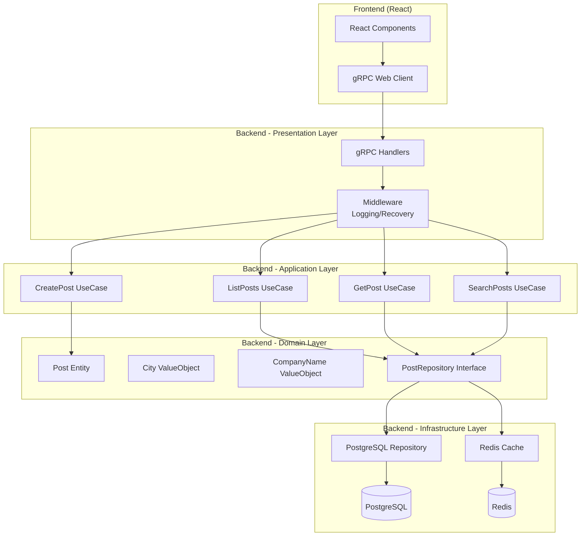

# Design Document

## Overview

本文档详细设计全国公司曝光平台第一版本（v1）的技术实现方案。第一版本实现三个核心功能：匿名发布、内容查看和搜索。采用 DDD 分层架构，后端使用 Go + gRPC，前端使用 React，数据存储使用 PostgreSQL 和 Redis。

**设计原则**：
- 遵循 DDD 分层架构，业务逻辑与基础设施分离
- 所有组件必须通过集成测试验证后才能使用
- 每个任务完成后必须完成测试验证
- 遵循 Go 代码规范（tech.md）

## Steering Document Alignment

### Technical Standards (tech.md)

本设计严格遵循技术栈文档（tech.md）中定义的标准：

1. **DDD 分层架构**：
   - Presentation Layer: gRPC Handlers
   - Application Layer: Use Cases
   - Domain Layer: Entities, Value Objects, Repository Interfaces
   - Infrastructure Layer: PostgreSQL Repository, Redis Cache

2. **Go 代码规范**：
   - 遵循所有必须（[火箭]）规范
   - 遵循推荐（[火]）规范
   - 文件长度不超过 800 行
   - 函数长度不超过 80 行
   - 嵌套深度不超过 4 层

3. **测试要求**：
   - 单元测试覆盖率 >= 70%（核心业务逻辑 >= 90%）
   - 必须完成集成测试（使用真实 PostgreSQL 和 Redis）
   - 必须完成 E2E 测试

4. **三方组件验证**：
   - 所有三方组件（PostgreSQL Repository、Redis Cache）必须调通后再进入下一步
   - 集成测试通过后才能继续开发

### Project Structure (structure.md)

本设计遵循项目结构文档（structure.md）中定义的组织方式：

1. **目录结构**：
   - `backend/internal/domain/` - 领域层
   - `backend/internal/application/` - 应用层
   - `backend/internal/infrastructure/` - 基础设施层
   - `backend/internal/presentation/` - 表现层

2. **命名规范**：
   - Go 文件：`snake_case.go`
   - 类型：`PascalCase`
   - 函数：`camelCase`
   - 常量：`UPPER_SNAKE_CASE`

3. **文档组织**：
   - 设计文档放在 `docs/design/`
   - 修复文档放在 `docs/fixes/`
   - 每个包必须有 README.md 文档（见下方"包文档要求"）

## Code Reuse Analysis

### Existing Components to Leverage

本项目为全新项目，暂无现有代码可复用。但将创建可复用的基础组件：

1. **错误处理包** (`pkg/errors/`)：
   - 定义统一的错误类型
   - 错误码和错误消息映射
   - 可被所有层使用

2. **验证工具包** (`pkg/validator/`)：
   - 基于 `github.com/go-playground/validator/v10`
   - 统一的验证规则
   - 可被 Application Layer 使用

3. **配置管理** (`internal/infrastructure/config/`)：
   - 基于 `github.com/spf13/viper`
   - 统一的配置读取
   - 可被所有层使用

4. **日志工具** (`internal/infrastructure/logger/`)：
   - 基于 `go.uber.org/zap`
   - 结构化日志
   - 可被所有层使用

### Integration Points

1. **PostgreSQL 集成**：
   - 使用 `github.com/lib/pq` 或 `gorm.io/gorm`
   - 通过 Repository 接口隔离
   - 数据库迁移使用 `golang-migrate/migrate`

2. **Redis 集成**：
   - 使用 `github.com/redis/go-redis/v9`
   - 通过 Cache Repository 接口隔离
   - 支持缓存和限流

3. **gRPC 集成**：
   - 使用 `google.golang.org/grpc`
   - Protocol Buffers 定义 API
   - 代码自动生成

## Architecture

### 整体架构

采用 DDD 分层架构，清晰的职责分离：



### Modular Design Principles

1. **Single File Responsibility**：
   - 每个文件只负责一个明确的职责
   - 例如：`create_post.go` 只包含创建帖子的用例逻辑

2. **Component Isolation**：
   - 领域层完全独立，不依赖任何基础设施
   - Repository 接口定义在 Domain Layer，实现在 Infrastructure Layer

3. **Service Layer Separation**：
   - Application Layer 只包含用例逻辑，不包含业务规则
   - Domain Layer 包含所有业务规则和领域逻辑

4. **Utility Modularity**：
   - 工具函数放在 `pkg/` 目录，可被所有层使用
   - 每个工具包职责单一

## Components and Interfaces

### Domain Layer

#### Post Entity (聚合根)

**文件**: `backend/internal/domain/content/entity.go`

**Purpose**: 表示曝光内容的聚合根，包含业务规则和不变性约束

**Interfaces**:
```go
// Post 曝光内容聚合根
type Post struct {
    id        PostID
    company   CompanyName
    city      City
    content   Content
    createdAt time.Time
}

// NewPost 创建新的 Post（工厂方法）
func NewPost(company CompanyName, city City, content Content) (*Post, error)

// Publish 发布内容（业务方法）
func (p *Post) Publish() error

// ID 获取 Post ID
func (p *Post) ID() PostID

// Company 获取公司名称
func (p *Post) Company() CompanyName

// City 获取城市
func (p *Post) City() City

// Content 获取内容
func (p *Post) Content() Content

// CreatedAt 获取创建时间
func (p *Post) CreatedAt() time.Time
```

**Dependencies**: 
- `PostID` (值对象)
- `CompanyName` (值对象)
- `City` (值对象)
- `Content` (值对象)

**Business Rules**:
- 公司名称不能为空，长度 1-100 字符
- 城市必须是有效城市
- 内容不能为空，长度 10-5000 字符
- 创建时间自动设置为当前时间

#### Value Objects

**文件**: `backend/internal/domain/content/value_object.go`

**PostID**:
```go
// PostID 帖子唯一标识符
type PostID struct {
    value string // UUID 格式
}

// NewPostID 创建新的 PostID
func NewPostID(value string) (PostID, error)

// String 返回字符串表示
func (id PostID) String() string
```

**CompanyName**:
```go
// CompanyName 公司名称值对象
type CompanyName struct {
    value string
}

// NewCompanyName 创建新的 CompanyName
func NewCompanyName(value string) (CompanyName, error)

// String 返回字符串表示
func (cn CompanyName) String() string
```

**Content**:
```go
// Content 内容值对象
type Content struct {
    value string
}

// NewContent 创建新的 Content
func NewContent(value string) (Content, error)

// String 返回字符串表示
func (c Content) String() string

// Summary 返回摘要（前 200 字符）
func (c Content) Summary() string
```

**City**:
```go
// City 城市值对象
type City struct {
    code string // 城市代码，如 "beijing"
    name string // 城市名称，如 "北京"
}

// NewCity 创建新的 City
func NewCity(code, name string) (City, error)

// Code 返回城市代码
func (c City) Code() string

// Name 返回城市名称
func (c City) Name() string
```

#### PostRepository Interface

**文件**: `backend/internal/domain/content/repository.go`

**Purpose**: 定义 Post 的持久化接口，遵循依赖倒置原则

**Interfaces**:
```go
// PostRepository Post 仓储接口
type PostRepository interface {
    // Save 保存 Post
    Save(ctx context.Context, post *Post) error
    
    // FindByID 根据 ID 查找 Post
    FindByID(ctx context.Context, id PostID) (*Post, error)
    
    // FindByCity 根据城市查找 Post 列表（分页）
    FindByCity(ctx context.Context, city City, page, pageSize int) ([]*Post, int, error)
    
    // Search 搜索 Post（全文搜索）
    Search(ctx context.Context, keyword string, city *City, page, pageSize int) ([]*Post, int, error)
}
```

**Dependencies**: Domain Layer 的 Post Entity

**Reuses**: 无（接口定义，不依赖实现）

### Application Layer

#### CreatePost UseCase

**文件**: `backend/internal/application/content/create_post.go`

**Purpose**: 处理创建曝光内容的用例逻辑

**Interfaces**:
```go
// CreatePostCommand 创建 Post 的命令
type CreatePostCommand struct {
    Company   string
    CityCode  string
    Content   string
    OccurredAt *time.Time // 可选
}

// CreatePostUseCase 创建 Post 用例
type CreatePostUseCase struct {
    repo      domain.PostRepository
    cacheRepo CacheRepository
    rateLimiter RateLimiter
}

// NewCreatePostUseCase 创建用例实例
func NewCreatePostUseCase(repo domain.PostRepository, cacheRepo CacheRepository, rateLimiter RateLimiter) *CreatePostUseCase

// Execute 执行创建命令
func (uc *CreatePostUseCase) Execute(ctx context.Context, cmd CreatePostCommand) (*PostDTO, error)
```

**Dependencies**:
- `domain.PostRepository` (接口)
- `CacheRepository` (接口，用于缓存失效)
- `RateLimiter` (接口，用于限流)

**Reuses**:
- Domain Layer 的 Post Entity
- Domain Layer 的 Value Objects

**Business Logic**:
1. 验证输入（使用 validator）
2. 检查限流（使用 RateLimiter）
3. 创建 Domain Entity
4. 保存到 Repository
5. 清除相关缓存
6. 返回 DTO

#### ListPosts UseCase

**文件**: `backend/internal/application/content/list_posts.go`

**Purpose**: 处理列表查询用例逻辑

**Interfaces**:
```go
// ListPostsQuery 列表查询参数
type ListPostsQuery struct {
    CityCode string
    Page     int
    PageSize int
}

// ListPostsUseCase 列表查询用例
type ListPostsUseCase struct {
    repo      domain.PostRepository
    cacheRepo CacheRepository
}

// Execute 执行查询
func (uc *ListPostsUseCase) Execute(ctx context.Context, query ListPostsQuery) (*PostsListDTO, error)
```

**Dependencies**:
- `domain.PostRepository`
- `CacheRepository`

**Caching Strategy**:
- 缓存 Key: `posts:city:{cityCode}:page:{page}`
- 缓存 TTL: 5 分钟（热门城市）或 10 分钟（其他城市）
- 缓存未命中时查询数据库，并更新缓存

#### GetPost UseCase

**文件**: `backend/internal/application/content/get_post.go`

**Purpose**: 处理获取单个 Post 详情用例逻辑

**Interfaces**:
```go
// GetPostUseCase 获取 Post 用例
type GetPostUseCase struct {
    repo      domain.PostRepository
    cacheRepo CacheRepository
}

// Execute 执行查询
func (uc *GetPostUseCase) Execute(ctx context.Context, postID string) (*PostDTO, error)
```

**Caching Strategy**:
- 缓存 Key: `post:{postID}`
- 缓存 TTL: 10 分钟

#### SearchPosts UseCase

**文件**: `backend/internal/application/search/search_posts.go`

**Purpose**: 处理搜索用例逻辑

**Interfaces**:
```go
// SearchPostsQuery 搜索查询参数
type SearchPostsQuery struct {
    Keyword  string
    CityCode *string // 可选
    Page     int
    PageSize int
}

// SearchPostsUseCase 搜索用例
type SearchPostsUseCase struct {
    repo      domain.PostRepository
    cacheRepo CacheRepository
}

// Execute 执行搜索
func (uc *SearchPostsUseCase) Execute(ctx context.Context, query SearchPostsQuery) (*PostsListDTO, error)
```

**Search Strategy**:
- 使用 PostgreSQL 全文搜索（tsvector/tsquery）
- 搜索范围：公司名称、内容
- 支持中文分词（使用 PostgreSQL 中文分词扩展，如 pg_jieba）

### Infrastructure Layer

#### PostgreSQL Repository Implementation

**文件**: `backend/internal/infrastructure/persistence/postgres/post_repository.go`

**Purpose**: 实现 PostRepository 接口，使用 PostgreSQL 存储

**Interfaces**:
```go
// PostRepository PostgreSQL 实现
type PostRepository struct {
    db *sql.DB
}

// NewPostRepository 创建 Repository 实例
func NewPostRepository(db *sql.DB) *PostRepository

// Save 实现 domain.PostRepository.Save
func (r *PostRepository) Save(ctx context.Context, post *domain.Post) error

// FindByID 实现 domain.PostRepository.FindByID
func (r *PostRepository) FindByID(ctx context.Context, id domain.PostID) (*domain.Post, error)

// FindByCity 实现 domain.PostRepository.FindByCity
func (r *PostRepository) FindByCity(ctx context.Context, city domain.City, page, pageSize int) ([]*domain.Post, int, error)

// Search 实现 domain.PostRepository.Search
func (r *PostRepository) Search(ctx context.Context, keyword string, city *domain.City, page, pageSize int) ([]*domain.Post, int, error)
```

**Dependencies**:
- `database/sql` (标准库)
- `github.com/lib/pq` (PostgreSQL 驱动)

**Database Schema**:
```sql
CREATE TABLE posts (
    id UUID PRIMARY KEY DEFAULT gen_random_uuid(),
    company_name VARCHAR(100) NOT NULL,
    city_code VARCHAR(50) NOT NULL,
    city_name VARCHAR(50) NOT NULL,
    content TEXT NOT NULL,
    occurred_at TIMESTAMP,
    created_at TIMESTAMP NOT NULL DEFAULT NOW(),
    updated_at TIMESTAMP NOT NULL DEFAULT NOW()
);

-- 索引
CREATE INDEX idx_posts_city_code ON posts(city_code);
CREATE INDEX idx_posts_created_at ON posts(created_at DESC);
CREATE INDEX idx_posts_company_name ON posts(company_name);

-- 全文搜索索引
CREATE INDEX idx_posts_search ON posts USING GIN(to_tsvector('jiebacfg', company_name || ' ' || content));
```

**Integration Test Requirements**:
- 必须使用真实 PostgreSQL 数据库
- 每个测试用例使用独立事务，测试后回滚
- 验证所有 CRUD 操作
- 验证全文搜索功能

#### Redis Cache Implementation

**文件**: `backend/internal/infrastructure/persistence/redis/cache_repository.go`

**Purpose**: 实现缓存和限流功能

**Interfaces**:
```go
// CacheRepository 缓存接口
type CacheRepository interface {
    // Get 获取缓存
    Get(ctx context.Context, key string) (string, error)
    
    // Set 设置缓存
    Set(ctx context.Context, key string, value string, ttl time.Duration) error
    
    // Delete 删除缓存
    Delete(ctx context.Context, key string) error
    
    // DeleteByPattern 按模式删除缓存
    DeleteByPattern(ctx context.Context, pattern string) error
}

// RateLimiter 限流接口
type RateLimiter interface {
    // Allow 检查是否允许请求
    Allow(ctx context.Context, key string, limit int, window time.Duration) (bool, error)
}

// RedisCache Redis 缓存实现
type RedisCache struct {
    client *redis.Client
}

// RedisRateLimiter Redis 限流实现
type RedisRateLimiter struct {
    client *redis.Client
}
```

**Dependencies**:
- `github.com/redis/go-redis/v9`

**Cache Keys**:
- 列表缓存: `posts:city:{cityCode}:page:{page}`
- 详情缓存: `post:{postID}`
- 搜索缓存: `search:{keyword}:city:{cityCode}:page:{page}`
- 限流 Key: `rate_limit:post:{ip}:{hour}`

**Integration Test Requirements**:
- 必须使用真实 Redis
- 验证 Get/Set/Delete 操作
- 验证 TTL 设置
- 验证限流功能
- 验证错误处理（Redis 故障降级）

### Presentation Layer

#### gRPC Handlers

**文件**: `backend/internal/presentation/grpc/content_handler.go`

**Purpose**: 处理 gRPC 请求，调用 Application Layer 的 Use Cases

**Interfaces**:
```go
// ContentService gRPC 服务实现
type ContentService struct {
    createUseCase *application.CreatePostUseCase
    listUseCase   *application.ListPostsUseCase
    getUseCase    *application.GetPostUseCase
    searchUseCase *application.SearchPostsUseCase
}

// CreatePost 处理创建请求
func (s *ContentService) CreatePost(ctx context.Context, req *pb.CreatePostRequest) (*pb.CreatePostResponse, error)

// ListPosts 处理列表请求
func (s *ContentService) ListPosts(ctx context.Context, req *pb.ListPostsRequest) (*pb.ListPostsResponse, error)

// GetPost 处理详情请求
func (s *ContentService) GetPost(ctx context.Context, req *pb.GetPostRequest) (*pb.GetPostResponse, error)

// SearchPosts 处理搜索请求
func (s *ContentService) SearchPosts(ctx context.Context, req *pb.SearchPostsRequest) (*pb.SearchPostsResponse, error)
```

**Dependencies**:
- Application Layer 的 Use Cases
- Protocol Buffers 生成的代码

#### Middleware

**文件**: `backend/internal/presentation/middleware/logging.go`, `recovery.go`

**Purpose**: 提供日志记录和错误恢复中间件

**Interfaces**:
```go
// LoggingInterceptor gRPC 日志中间件
func LoggingInterceptor() grpc.UnaryServerInterceptor

// RecoveryInterceptor gRPC 恢复中间件
func RecoveryInterceptor() grpc.UnaryServerInterceptor
```

## Data Models

### PostgreSQL Schema

#### posts 表

```sql
CREATE TABLE posts (
    id UUID PRIMARY KEY DEFAULT gen_random_uuid(),
    company_name VARCHAR(100) NOT NULL,
    city_code VARCHAR(50) NOT NULL,
    city_name VARCHAR(50) NOT NULL,
    content TEXT NOT NULL,
    occurred_at TIMESTAMP,
    created_at TIMESTAMP NOT NULL DEFAULT NOW(),
    updated_at TIMESTAMP NOT NULL DEFAULT NOW()
);

-- 索引
CREATE INDEX idx_posts_city_code ON posts(city_code);
CREATE INDEX idx_posts_created_at ON posts(created_at DESC);
CREATE INDEX idx_posts_company_name ON posts(company_name);

-- 全文搜索索引（需要安装 pg_jieba 扩展）
CREATE EXTENSION IF NOT EXISTS pg_jieba;
CREATE INDEX idx_posts_search ON posts USING GIN(
    to_tsvector('jiebacfg', company_name || ' ' || content)
);
```

#### cities 表（配置表）

```sql
CREATE TABLE cities (
    code VARCHAR(50) PRIMARY KEY,
    name VARCHAR(50) NOT NULL,
    pinyin VARCHAR(100),
    created_at TIMESTAMP NOT NULL DEFAULT NOW()
);

CREATE INDEX idx_cities_name ON cities(name);
```

### Protocol Buffers Schema

#### content.proto

```protobuf
syntax = "proto3";

package content.v1;

option go_package = "fuck_boss/api/proto/content/v1;contentv1";

// ContentService 内容服务
service ContentService {
  // CreatePost 创建曝光内容
  rpc CreatePost(CreatePostRequest) returns (CreatePostResponse);
  
  // ListPosts 获取内容列表
  rpc ListPosts(ListPostsRequest) returns (ListPostsResponse);
  
  // GetPost 获取内容详情
  rpc GetPost(GetPostRequest) returns (GetPostResponse);
  
  // SearchPosts 搜索内容
  rpc SearchPosts(SearchPostsRequest) returns (SearchPostsResponse);
}

// CreatePostRequest 创建请求
message CreatePostRequest {
  string company = 1;        // 公司名称
  string city_code = 2;      // 城市代码
  string content = 3;        // 内容
  int64 occurred_at = 4;     // 发生时间（Unix 时间戳，可选）
}

// CreatePostResponse 创建响应
message CreatePostResponse {
  string post_id = 1;        // 帖子 ID
  int64 created_at = 2;      // 创建时间
}

// ListPostsRequest 列表请求
message ListPostsRequest {
  string city_code = 1;      // 城市代码
  int32 page = 2;            // 页码（从 1 开始）
  int32 page_size = 3;       // 每页数量
}

// ListPostsResponse 列表响应
message ListPostsResponse {
  repeated Post posts = 1;   // 帖子列表
  int32 total = 2;           // 总数
  int32 page = 3;            // 当前页码
  int32 page_size = 4;       // 每页数量
}

// GetPostRequest 详情请求
message GetPostRequest {
  string post_id = 1;        // 帖子 ID
}

// GetPostResponse 详情响应
message GetPostResponse {
  Post post = 1;             // 帖子详情
}

// SearchPostsRequest 搜索请求
message SearchPostsRequest {
  string keyword = 1;        // 搜索关键词
  string city_code = 2;      // 城市代码（可选）
  int32 page = 3;            // 页码
  int32 page_size = 4;       // 每页数量
}

// SearchPostsResponse 搜索响应
message SearchPostsResponse {
  repeated Post posts = 1;   // 帖子列表
  int32 total = 2;           // 总数
  int32 page = 3;            // 当前页码
  int32 page_size = 4;       // 每页数量
}

// Post 帖子
message Post {
  string id = 1;             // 帖子 ID
  string company = 2;        // 公司名称
  string city_code = 3;      // 城市代码
  string city_name = 4;      // 城市名称
  string content = 5;        // 内容
  int64 occurred_at = 6;     // 发生时间
  int64 created_at = 7;      // 创建时间
}
```

## Error Handling

### Error Scenarios

1. **验证错误**：
   - **场景**: 用户输入不符合要求（公司名称为空、内容过短等）
   - **处理**: 返回详细的验证错误信息
   - **用户影响**: 显示具体字段的错误提示

2. **限流错误**：
   - **场景**: 同一 IP 在 1 小时内发布超过 3 次
   - **处理**: 返回限流错误，包含剩余时间
   - **用户影响**: 显示"发布过于频繁，请稍后再试"

3. **数据库错误**：
   - **场景**: 数据库连接失败、查询超时等
   - **处理**: 记录错误日志，返回通用错误信息
   - **用户影响**: 显示"服务暂时不可用，请稍后重试"

4. **缓存错误**：
   - **场景**: Redis 连接失败
   - **处理**: 降级到直接查询数据库，记录警告日志
   - **用户影响**: 无（透明降级，用户无感知）

5. **未找到错误**：
   - **场景**: 查询不存在的 Post ID
   - **处理**: 返回 NotFound 错误
   - **用户影响**: 显示 404 页面或错误提示

### Error Types

**文件**: `backend/pkg/errors/errors.go`

```go
// ErrorCode 错误码
type ErrorCode string

const (
    ErrCodeValidation   ErrorCode = "VALIDATION_ERROR"
    ErrCodeNotFound     ErrorCode = "NOT_FOUND"
    ErrCodeRateLimit    ErrorCode = "RATE_LIMIT_EXCEEDED"
    ErrCodeInternal     ErrorCode = "INTERNAL_ERROR"
    ErrCodeDatabase     ErrorCode = "DATABASE_ERROR"
)

// AppError 应用错误
type AppError struct {
    Code    ErrorCode
    Message string
    Details map[string]interface{}
    Cause   error
}

func (e *AppError) Error() string {
    return e.Message
}
```

## Testing Strategy

### Unit Testing

**测试范围**:
- Domain Layer: 所有 Entity、Value Object、业务方法
- Application Layer: 所有 Use Case（Mock Repository）
- Infrastructure Layer: Repository 实现（Mock 数据库）

**测试文件组织**:
```
backend/test/unit/
├── domain/
│   └── content/
│       ├── entity_test.go
│       └── value_object_test.go
├── application/
│   └── content/
│       ├── create_post_test.go
│       ├── list_posts_test.go
│       └── get_post_test.go
└── infrastructure/
    └── persistence/
        └── postgres/
            └── post_repository_test.go
```

**示例测试**:
```go
// backend/test/unit/domain/content/entity_test.go
func TestPost_NewPost(t *testing.T) {
    company, _ := domain.NewCompanyName("测试公司")
    city, _ := domain.NewCity("beijing", "北京")
    content, _ := domain.NewContent("这是一条测试内容")
    
    post, err := domain.NewPost(company, city, content)
    require.NoError(t, err)
    require.NotNil(t, post)
    require.NotEmpty(t, post.ID().String())
}
```

### Integration Testing

**测试范围**:
- Repository 与 PostgreSQL 集成
- Cache 与 Redis 集成
- 完整的 Use Case 流程（使用真实数据库和缓存）

**测试环境**:
- 使用 Docker Compose 启动 PostgreSQL 和 Redis
- 每个测试用例使用独立事务，测试后回滚
- 测试数据隔离

**测试文件组织**:
```
backend/test/integration/
├── repository/
│   └── post_repository_test.go
├── cache/
│   └── redis_cache_test.go
└── usecase/
    └── create_post_test.go
```

**示例测试**:
```go
// backend/test/integration/repository/post_repository_test.go
func TestPostRepository_Save(t *testing.T) {
    db := setupTestDB(t)
    defer db.Close()
    
    repo := postgres.NewPostRepository(db)
    
    company, _ := domain.NewCompanyName("测试公司")
    city, _ := domain.NewCity("beijing", "北京")
    content, _ := domain.NewContent("这是一条测试内容")
    post, _ := domain.NewPost(company, city, content)
    
    err := repo.Save(context.Background(), post)
    require.NoError(t, err)
    
    // 验证保存成功
    found, err := repo.FindByID(context.Background(), post.ID())
    require.NoError(t, err)
    require.Equal(t, post.ID(), found.ID())
}
```

### End-to-End Testing

**测试范围**:
- 完整的用户流程（发布 → 查看 → 搜索）
- gRPC 服务端到端测试

**测试场景**:
1. 用户发布内容 → 查看列表 → 查看详情
2. 用户搜索关键词 → 查看结果
3. 用户发布内容 → 触发限流 → 显示错误

**测试文件组织**:
```
backend/test/e2e/
└── scenarios/
    ├── create_and_view_test.go
    └── search_test.go
```

## 包文档要求（README.md）

### 要求

**每个包（package）都必须有 README.md 文档**，放在包的根目录下。README 文档帮助开发者快速理解包的用途、使用方法和注意事项。

### README 文档结构

每个包的 README.md 应包含以下部分：

1. **标题和简介**
   - 包名和简要说明
   - 包的主要功能

2. **功能说明**
   - 包提供的核心功能
   - 主要组件/接口列表

3. **使用示例**
   - 基本的导入和使用示例
   - 常见使用场景的代码示例

4. **API 说明**（如适用）
   - 主要类型和接口
   - 重要函数的签名和说明

5. **注意事项**
   - 使用限制
   - 最佳实践
   - 常见问题

6. **相关文档**
   - 链接到相关设计文档
   - 链接到相关规范文档

### 包文档清单

以下包必须包含 README.md：

#### pkg/（公共包）
- `backend/pkg/errors/README.md` - 错误处理包
- `backend/pkg/validator/README.md` - 验证工具包
- `backend/pkg/utils/README.md` - 工具函数包

#### internal/domain/（领域层）
- `backend/internal/domain/content/README.md` - 内容领域
- `backend/internal/domain/search/README.md` - 搜索领域
- `backend/internal/domain/shared/README.md` - 共享领域概念

#### internal/application/（应用层）
- `backend/internal/application/content/README.md` - 内容用例
- `backend/internal/application/search/README.md` - 搜索用例
- `backend/internal/application/dto/README.md` - 数据传输对象

#### internal/infrastructure/（基础设施层）
- `backend/internal/infrastructure/persistence/postgres/README.md` - PostgreSQL 实现
- `backend/internal/infrastructure/persistence/redis/README.md` - Redis 实现
- `backend/internal/infrastructure/config/README.md` - 配置管理
- `backend/internal/infrastructure/logger/README.md` - 日志工具

#### internal/presentation/（表现层）
- `backend/internal/presentation/grpc/README.md` - gRPC 处理器
- `backend/internal/presentation/middleware/README.md` - 中间件

#### 其他
- `backend/cmd/server/README.md` - 服务器入口
- `backend/api/proto/README.md` - Protocol Buffers 定义
- `backend/test/README.md` - 测试文件说明
- `backend/scripts/README.md` - 脚本文件说明

### README 文档模板

```markdown
# [包名] - [简要说明]

[包的详细功能说明]

## 功能

- [功能 1]
- [功能 2]

## 使用示例

\`\`\`go
import "[包路径]"

// 使用示例代码
\`\`\`

## 主要组件

### [组件 1]
[组件说明]

### [组件 2]
[组件说明]

## 注意事项

- [注意事项 1]
- [注意事项 2]

## 相关文档

- [设计文档链接]
- [规范文档链接]
```

### 文档维护要求

1. **创建时机**：
   - 包创建时同步创建 README.md
   - 在实现包的主要功能后完善 README

2. **更新时机**：
   - 包的功能发生变化时，必须更新 README
   - 添加新的公开接口时，更新 README
   - 修改 API 时，更新 README

3. **代码审查**：
   - 代码审查时检查 README 是否与代码一致
   - README 更新应作为代码审查的一部分

4. **验证清单**：
   - 每个组件实现后，检查 README.md 是否已创建
   - 验证 README 内容是否准确、完整
   - 确保使用示例可以运行

### README 质量标准

- **准确性**：README 内容必须与代码实现一致
- **完整性**：包含必要的使用说明和示例
- **清晰性**：语言简洁明了，易于理解
- **实用性**：提供实际可用的代码示例

## Implementation Verification Checklist

每个组件实现后，必须完成以下验证：

### ⚠️ 代码提交要求（必须）

**每次完成一个任务后，必须提交代码到 Git 仓库。**

1. **提交时机**：
   - 任务完成后立即提交
   - 测试通过后提交
   - 文档更新后提交

2. **提交规范**：
   - 提交信息清晰描述完成的工作
   - 格式：`feat: [任务ID] 任务描述` 或 `fix: [任务ID] 修复描述`
   - 示例：`feat: [1.2] 实现统一错误处理包`

3. **提交内容**：
   - 实现代码
   - 测试代码
   - 相关文档（README.md）
   - 配置文件（如需要）

4. **验证要求**：
   - 代码必须通过所有测试
   - 代码必须通过 lint 检查
   - 提交前必须运行 `git status` 检查
   - 确保敏感文件（如 `config.yaml`）不被提交

5. **提交命令示例**：
   ```bash
   # 检查状态
   git status
   
   # 添加文件
   git add .
   
   # 提交
   git commit -m "feat: [任务ID] 任务描述"
   
   # 推送到远程仓库
   git push origin main
   ```

**重要**：未提交代码的任务视为未完成，不得进入下一个任务。

### PostgreSQL Repository
- [ ] 单元测试通过（Mock 数据库）
- [ ] 集成测试通过（真实 PostgreSQL）
- [ ] 验证 Save 操作
- [ ] 验证 FindByID 操作
- [ ] 验证 FindByCity 操作（分页）
- [ ] 验证 Search 操作（全文搜索）
- [ ] 验证事务处理
- [ ] 验证错误处理
- [ ] 验证性能（查询时间 < 500ms）
- [ ] README.md 已创建并更新

### Redis Cache
- [ ] 单元测试通过（Mock Redis）
- [ ] 集成测试通过（真实 Redis）
- [ ] 验证 Get/Set 操作
- [ ] 验证 Delete 操作
- [ ] 验证 TTL 设置
- [ ] 验证限流功能
- [ ] 验证错误处理（Redis 故障降级）
- [ ] 验证性能（操作时间 < 10ms）
- [ ] README.md 已创建并更新

### Use Cases
- [ ] 单元测试通过（Mock Repository）
- [ ] 集成测试通过（真实 Repository）
- [ ] 验证业务逻辑
- [ ] 验证缓存策略
- [ ] 验证错误处理
- [ ] README.md 已创建并更新

### gRPC Handlers
- [ ] 单元测试通过（Mock UseCase）
- [ ] E2E 测试通过（完整流程）
- [ ] 验证请求验证
- [ ] 验证错误转换
- [ ] 验证中间件
- [ ] README.md 已创建并更新

